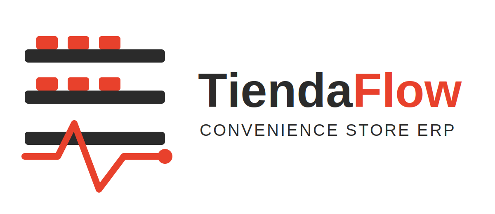

# TiendaFlow — ERP System for OXXO (Convenience Stores)

**Course:** CADI Software Engineering II — Laboratory Guide 1: Software Architecture and Quality Attributes
**Professor:** Carlos Eduardo Mujica Reyes
**Institution:** Universidad de Cundinamarca, Chía Campus — Sixth Semester

**Team:** Juan Sebastián Rodríguez Blanco, Samuel Castellanos Rivera, Sergio Steeven Moreno Forero, Jonathan Alejandro Yacuma Rivera

🔗 **Repository:** [tiendaflow-erp](https://github.com/samucr27/tiendaflow-erp)

---

## 1. Evaluation of Advantages and Disadvantages

### 1.1 Advantages

- **High inventory turnover:** convenience stores handle hundreds of SKUs with daily restocking, which clearly demonstrates the value of a real-time inventory module.
- **Relevant and current problem:** the decentralized management of multiple points of sale is a real challenge for retail chains in Colombia and Latin America.
- **Value delivered to the end user:** a specialized ERP reduces losses from stockouts or overstock and speeds up the daily operation of each store.
- **Scalability of the case study:** OXXO operates under a franchise/standard-store model, which allows defining replicable processes and reusable modules across stores.
- **Availability of references:** consolidated ERP and POS solutions already exist in the market (SAP Business One, Odoo, Square), serving as a benchmark and technical comparison point.

### 1.2 Disadvantages

- **Integration complexity:** a retail ERP requires coherently integrating inventory, sales, suppliers, HR, and CRM modules, which exceeds the depth achievable within the course timeframe.
- **Limited access to real OXXO data:** since this is not an official development for the company, data and processes will be based on public information and reasonable inferences about the sector.
- **Demanding non-functional requirements:** high transaction concurrency (multiple registers, multiple stores) requires special attention to performance and availability, quality attributes that must be designed from the architecture stage.

### 1.3 Justification of the Project's Validity

Considering the technical aspects (the need for a distributed, multi-store system with real-time transaction processing), the relevance of the problem (efficient inventory and sales management in convenience-store chains), and the value delivered to the end user (reduced losses, operational agility, and a better shopping experience), the group considers it valid and appropriate to develop an ERP inspired by OXXO's business model as the project for this course.

---

## 2. General Project Definition

### A. Problem Definition

Convenience stores such as OXXO operate under a high-transaction-volume model with multiple geographically distributed points of sale. The lack of an integrated system makes it difficult to control inventory in real time, coordinate with suppliers, schedule staff shifts, and track customer preferences, resulting in losses from stockouts, overstock, long service times, and low customer loyalty.

### B. Proposed Solution

A modular ERP (Enterprise Resource Planning) system is proposed, aimed at the comprehensive management of convenience stores such as OXXO. The system centralizes information on inventory, sales/billing, suppliers, human resources, and customer relationship management (CRM), allowing each store to operate in sync on a single platform. The expected product is a web application (and optionally a mobile app for the point of sale) that automates the daily operational processes of a convenience-store chain.

### C. Justification

The project generates value by solving a real, high-impact operational problem for high-turnover retail businesses. Automating inventory and sales control reduces losses, improves managerial decision-making through real-time reporting, and standardizes processes across stores, which is especially valuable in franchise models such as OXXO's.

### D. End Users

- **Store managers/administrators:** oversee inventory, sales, and staff.
- **Cashiers/operational staff:** use the point-of-sale (POS) module for daily transactions.
- **Logistics and supplier coordinators:** manage purchase orders and restocking.
- **Corporate management:** reviews consolidated reports across all stores.
- **End customers:** benefit indirectly through the loyalty program and product availability.

### E. Usefulness (Return on Investment)

The return on investment is estimated based on reduced losses from expired or out-of-stock products, decreased operational time (shifts, billing, supplier orders), and increased sales through better-managed loyalty programs. In the medium term, standardizing processes across stores reduces training and operational support costs.

---

## 3. Workspace

- **Repository:** [https://github.com/samucr27/tiendaflow-erp](https://github.com/samucr27/tiendaflow-erp)
- **Documentation page:** [https://samucr27.github.io/tiendaflow-erp/](https://samucr27.github.io/tiendaflow-erp/)
- All group members have collaborator access to the repository.

---

## 4. Initial Requirements Specification

### A. Background

Each team member researched at least one application similar to the one intended for development. The following comparative table presents the applications reviewed and the functionalities they offer.

| Application | Cost | Supplier Module | HR Module | Inventory/Warehouse Module | Billing/Sales Module | CRM/Customers Module |
|---|---|---|---|---|---|---|
| SAP Business One (sap.com) | License (quote-based) | Yes | Partial (via add-on) | Yes | Yes | Yes |
| Odoo ERP (odoo.com) | Freemium / subscription | Yes | Yes | Yes | Yes | Yes |
| Square for Retail (squareup.com) | Monthly subscription | Partial | No | Yes | Yes | Partial |

### B. Functional Requirements

Functional requirements are derived from the comparison above and add value compared to existing applications, particularly through specialization toward the operational model of convenience stores. They are presented through the following functional decomposition tree (maximum 4 levels of depth):

```
1. OXXO ERP System
   1.1 Inventory Management
       1.1.1 Stock control per store
             1.1.1.1 Minimum stock alerts
       1.1.2 Receiving of merchandise
             1.1.2.1 Batch and expiration date tracking
   1.2 Sales / Billing Management
       1.2.1 Point of Sale (POS)
             1.2.1.1 Checkout with multiple payment methods
       1.2.2 Electronic receipt issuance
   1.3 Supplier Management
       1.3.1 Purchase orders
             1.3.1.1 Delivery tracking
       1.3.2 Supplier evaluation
   1.4 Human Resources Management
       1.4.1 Shift scheduling
             1.4.1.1 Attendance control
       1.4.2 Basic payroll
   1.5 Customer Management (CRM)
       1.5.1 Loyalty / points program
             1.5.1.1 Promotion notifications
       1.5.2 Purchase history
```

### C. Non-Functional Requirements

- **Availability:** the system must be operational 24/7, since convenience stores operate continuously or on extended hours.
- **Performance:** point-of-sale transactions must be processed in under 2 seconds, even with multiple registers active simultaneously.
- **Scalability:** the architecture must support growth in the number of stores without degrading performance (multi-store/multi-tenant architecture).
- **Security:** role-based access control (cashier, administrator, supplier, corporate) and protection of customer and transaction data.
- **Usability:** a simple and intuitive point-of-sale interface to minimize staff training time.
- **Interoperability:** ability to integrate with electronic payment gateways and current electronic invoicing regulations in Colombia (DIAN).

### Product Identity: Name, Logo, and Color Palette

The ERP system developed by the team has been named **TiendaFlow**, a name that reflects the continuous, real-time flow of operations (inventory, sales, and staff coordination) across a chain of convenience stores.

The proposed visual identity uses a color palette composed of a red-orange tone (`#E8412C`), representing energy and the fast pace of retail operations; a charcoal gray (`#2B2B2B`), conveying reliability and technological solidity; and a light neutral background (`#F5F5F5`) for interface clarity and readability.

The logo combines a shelf/inventory icon with a pulse (flow) line, symbolizing real-time data movement across stores.



### D. System Scope

- **Includes:** inventory, sales/billing, suppliers, basic HR, and CRM/loyalty modules, for a single convenience-store model replicable across multiple locations.
- **Excludes:** full accounting/tax integration, distribution logistics between central warehouses, and advanced business intelligence (predictive analytics), which remain as future work.
- Development is limited to the academic time available during the semester, prioritizing a functional minimum viable product (MVP) over full coverage of a commercial ERP.

### E. Selected Technologies

- **Backend:** ASP.NET Core (C#) — Microsoft's official framework for building robust, high-performance REST APIs, well suited for handling concurrent transactions across multiple points of sale.
- **Frontend:** Blazor — Microsoft's web UI framework based on C#, allowing a structured, maintainable administrative panel and point-of-sale interface fully within the Microsoft ecosystem.
- **Database:** SQL Server — Microsoft's relational database engine, offering reliable transactional support, native integration with .NET, and replication strategies across stores.
- **IDE:** Visual Studio.
- **Version control:** Git and GitHub.
- **Architecture documentation:** UML modeling with Visual Studio and Microsoft Visio.
- **Project management methodology:** Agile Scrum.

### F. Information Storage

All information developed in this document is published and kept up to date on this documentation page, along with the English presentation (10-15 minute format) summarizing points 1, 2, 3, and 4 of this guide.
